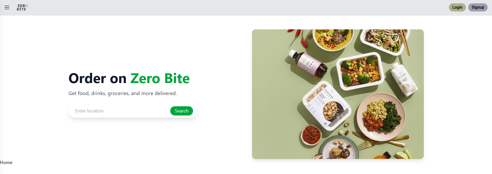
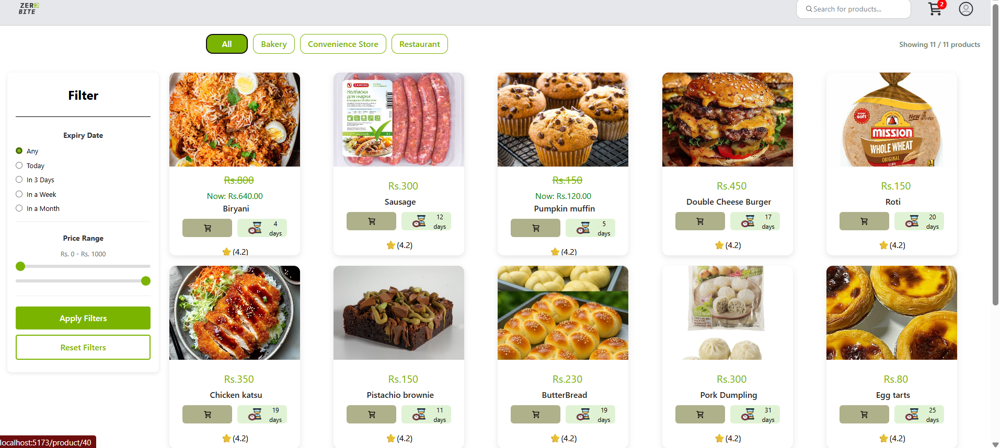
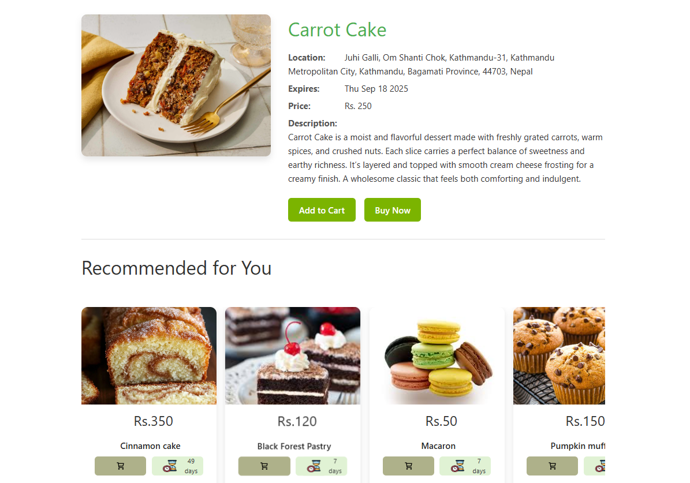
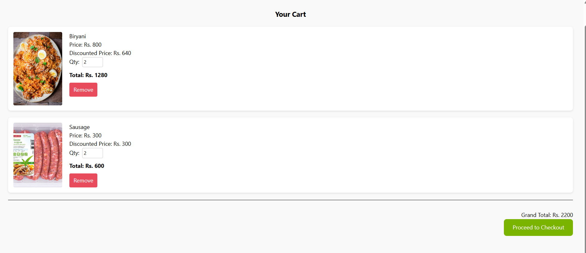
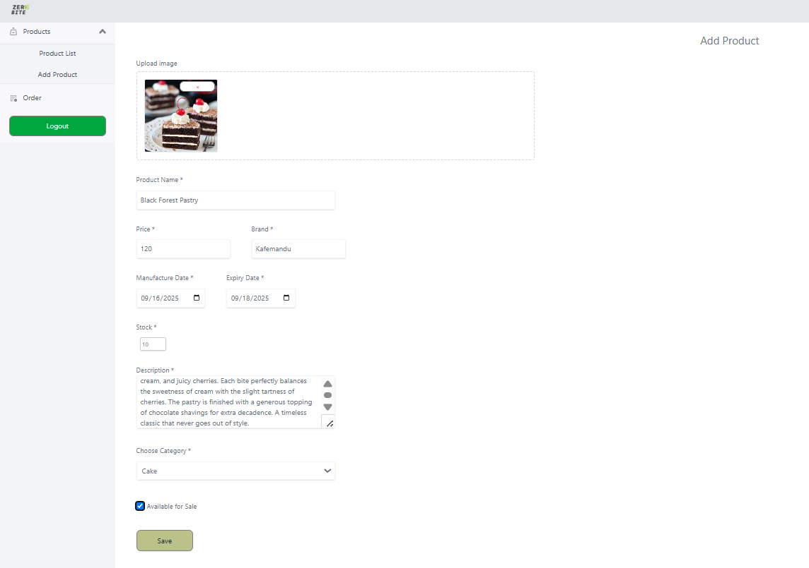

# 🌟 ZeroBite – A Sustainable Food Recommendation & Expiry Management Platform

#### ZeroBite is a sustainable food recommendation and expiry management platform that helps reduce food waste. Businesses can list surplus or near-expiry food products, while users can discover these products at discounted prices and receive personalized food recommendations.
---

## ✨ Key Features

**Secure Authentication** – User login, registration, and session-based authentication.

**Smart Recommendations** – Personalized meal/recipe suggestions based on user interactions.

**Dynamic Discounts** – Automatic discounts based on expiry dates.

**Expiry-Aware Sorting** – Products prioritized using a min-heap, showing soon-to-expire items near the user.

**Advanced Search & Filter** – Search by price, category, and expiry date.

---

## 🚀 Technologies Used

| Purpose     | Technologies           |
|------------|---------------------|
| **Frontend** | React, TailwindCSS |
| **Backend** | Django REST Framework |
| **Database** | Supabase(PostgreSQL) |

---

## 🖼️ Snapshots of the Project

📌 *(Add screenshots once available)*  

- **Landing Page** 
  
- **All Items Page**  
  
- **Recommendation Page**
   
- **Cart Page** 

- **Business Page to add products from business account**
  

---

## ⚙️ Setup Instructions

### ✅ Prerequisites

- Python 3.x installed  
- Node.js & npm installed  
- `pip` installed  
- A virtual environment tool (optional but recommended)  

---

### 🖥️ Steps to Run the Project
#### 1.Clone the Repository

      git clone https://github.com/Surja11/ZeroBite.git
      cd ZeroBite

#### 2.Backend Setup

  ##### Create a Virtual Environment

      (Optional but Recommended)
      On Windows:

      python -m venv venv
      venv\Scripts\activate

      On macOS/Linux:

      python3 -m venv venv
      source venv/bin/activate

  ##### Install Dependencies

      pip install -r requirements.txt

  ##### Apply Migrations

      python manage.py makemigrations 
      python manage.py migrate

  ##### Create Superuser (Optional – for Admin Access)

      python manage.py createsuperuser

  ##### Run the Development Server

      python manage.py runserver

  ##### Access the Application

      Open your browser and go to:

      http://127.0.0.1:8000/

#### 3.Frontend Setup

      cd frontend

      npm install
      

      npm run dev
